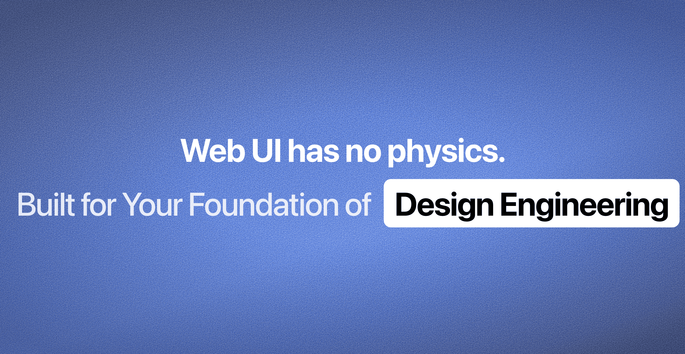

<div align="center">

<a href="https://ruixen.com">
  
</a>

<br />

# Ruixen UI

**Components that move like objects. Click like switches. Feel like something.**

170+ open-source React components built with spring physics, audio feedback, and zero styling dependencies.

[](LICENSE)
[](https://ruixen.com/docs)
<!-- [](https://discord.gg/bYexWzUa6G) -->
[](https://twitter.com/ruixen_ui)

[Browse Components](https://ruixen.com/docs) &nbsp;&middot;&nbsp; [Quick Start](https://ruixen.com/docs/installation) &nbsp;&middot;&nbsp; [Gradients](https://ruixen.com/gradients) &nbsp;&middot;&nbsp; [Blog](https://ruixen.com/blog)

</div>

<br />

## The Problem

Open any web app. Click a button. Watch it change state. The transition takes exactly 300ms, follows a cubic bezier curve, and stops dead. Every time. Regardless of distance, velocity, or intent.

That's not how physical objects move. Physical objects have **mass**, **momentum**, and **friction**. They overshoot when they arrive. They settle. They respond differently depending on how hard you push them.

Web UI has none of that. Ruixen UI fixes it.

<br />

## CSS Transitions vs Spring Physics

Every component in Ruixen UI replaces CSS timers with spring dynamics:

```tsx
// CSS: fixed duration, ignores distance and velocity
transition: transform 0.3s ease;

// Ruixen: spring adapts to distance naturally
// short moves are snappy, long moves carry momentum
transition={{ type: "spring", stiffness: 400, damping: 28 }}
```

A spring has **stiffness** (how hard it pulls toward the target), **damping** (how much friction slows it), and **mass** (how heavy the element feels). The same spring config produces different motion depending on distance — a 20px move is snappy, a 200px move has visible overshoot and settle. That's how real objects behave.

<br />

## Every Click Has a Sound

A 3ms noise burst plays on every interactive state change. Not a WAV. Not an MP3. A shaped noise signal generated in real time:

```tsx
const len = Math.floor(ctx.sampleRate * 0.003); // 3ms buffer
const buf = ctx.createBuffer(1, len, ctx.sampleRate);
const ch = buf.getChannelData(0);

for (let i = 0; i < len; i++)
  ch[i] = (Math.random() * 2 - 1) * (1 - i / len) ** 4;
//                                    ^^^^^^^^^^^^^^^^
//                    quartic decay envelope — sharp attack, instant fade

gain.gain.value = 0.06; // 6% volume — felt more than heard
```

Why noise instead of a sine wave? A sine wave at any frequency sounds electronic. Noise shaped by a fast decay sounds like a physical impact — a switch clicking, a key depressing. Your brain interprets it as mechanical, not digital.

Every component accepts `sound={false}` to disable it.

<br />

## Components

<table>
<tr>
<td width="33%" align="center">
<video src="https://github.com/ruixenui/ruixen.com/raw/refs/heads/main/public/landing-page-previews/faq-chat-accordion-dark.mp4" width="100%" autoplay loop muted playsinline></video>
<strong>FAQ Chat Accordion</strong><br /><sub>Conversational FAQ with spring message entrance</sub>
</td>
<td width="33%" align="center">
<video src="https://github.com/ruixenui/ruixen.com/raw/refs/heads/main/public/landing-page-previews/rising-glow-dark.mp4" width="100%" autoplay loop muted playsinline></video>
<strong>Rising Glow</strong><br /><sub>Animated particles with soft luminance</sub>
</td>
<td width="33%" align="center">
<video src="https://github.com/ruixenui/ruixen.com/raw/refs/heads/main/public/landing-page-previews/comment-thread-dark.mp4" width="100%" autoplay loop muted playsinline></video>
<strong>Comment Thread</strong><br /><sub>Nested replies with collapsible chains</sub>
</td>
</tr>
<tr>
<td width="33%" align="center">
<video src="https://github.com/ruixenui/ruixen.com/raw/refs/heads/main/public/landing-page-previews/badge-morph-dark.mp4" width="100%" autoplay loop muted playsinline></video>
<strong>Badge Morph</strong><br /><sub>Spring-animated status transitions</sub>
</td>
<td width="33%" align="center">
<video src="https://github.com/ruixenui/ruixen.com/raw/refs/heads/main/public/landing-page-previews/wordmark-footer-dark.mp4" width="100%" autoplay loop muted playsinline></video>
<strong>Wordmark Footer</strong><br /><sub>Half-cut brand text with luminance gradient</sub>
</td>
<td width="33%" align="center">
<video src="https://github.com/ruixenui/ruixen.com/raw/refs/heads/main/public/landing-page-previews/breadcrumb-dropdown-dark.mp4" width="100%" autoplay loop muted playsinline></video>
<strong>Breadcrumb Dropdown</strong><br /><sub>Staggered path reveal with spring expand</sub>
</td>
</tr>
</table>

<p align="center">
<a href="https://ruixen.com/docs"><strong>Browse all 170+ components &rarr;</strong></a>
</p>

<br />

## Showcase

Interactive templates and sections — full-page compositions built with Ruixen UI components:

<table>
<tr>
<td width="50%" align="center">
<video src="https://github.com/ruixenui/ruixen.com/raw/refs/heads/main/public/showcase/bloom-text-dark.mp4" width="100%" autoplay loop muted playsinline></video>
<strong>Bloom Text</strong>
</td>
<td width="50%" align="center">
<video src="https://github.com/ruixenui/ruixen.com/raw/refs/heads/main/public/showcase/models-carousel-dark.mp4" width="100%" autoplay loop muted playsinline></video>
<strong>Models Carousel</strong>
</td>
</tr>
<tr>
<td width="50%" align="center">
<video src="https://github.com/ruixenui/ruixen.com/raw/refs/heads/main/public/showcase/project-title-morph-dark.mp4" width="100%" autoplay loop muted playsinline></video>
<strong>Project Title Morph</strong>
</td>
<td width="50%" align="center">
<video src="https://github.com/ruixenui/ruixen.com/raw/refs/heads/main/public/showcase/instagram-stories-dark.mp4" width="100%" autoplay loop muted playsinline></video>
<strong>Instagram Stories</strong>
</td>
</tr>
</table>

<p align="center">
<a href="https://ruixen.com/showcase"><strong>View all showcases &rarr;</strong></a>
</p>

<br />

## Quick Start

**Add any component with one command:**

```bash
npx shadcn@latest add "https://ruixen.com/r/invert-tabs"
```

The component lands in your project with its dependencies resolved. No package to install, no provider to wrap, no global CSS to import.

**Works with any setup:**

```bash
# Tailwind v4 (default)
npx shadcn@latest add "https://ruixen.com/r/gooey-pagination"

# Tailwind v3
npx shadcn@latest add "https://ruixen.com/r/tw3/gooey-pagination"

# Base UI primitives
npx shadcn@latest add "https://ruixen.com/r/baseui/gooey-pagination"

# Base UI + Tailwind v3
npx shadcn@latest add "https://ruixen.com/r/baseui/tw3/gooey-pagination"
```

<br />

## 34 Component Categories

| | | | |
|:---|:---|:---|:---|
| Accordions | AI Chat Inputs | Audio & Media | Avatars |
| Backgrounds | Badges | Banners | Breadcrumbs |
| Buttons | Calendars | Cards | Carousels |
| Checkboxes | Client Sections | Date Pickers | Dialogs |
| Docks | Drawers | Event Calendars | FAQs |
| Featured Sections | File Trees | Footers | Forms |
| Hero Sections | Image Tools | Inputs | Loaders |
| Menus | Navbars | Notifications | Pagination |
| Pricing Sections | Select Components | Sliders | Steppers |
| Tabs | Text Effects | Video Players | |

<br />

## Design Principles

**Self-contained** — Every component is a single file. Inline styles, CSS variables, no external UI dependencies. Drop it into any React project. It works.

**Spring physics** — `motion/react` springs instead of CSS `transition`. Elements have stiffness, damping, and mass. Motion adapts to distance and velocity. A short move snaps. A long move overshoots and settles.

**Audio feedback** — 3ms noise burst via Web Audio API on every state change. Quartic decay envelope, 6% gain. Sounds mechanical, not digital. Configurable via `sound` prop.

**Theme adaptive** — CSS variables for light and dark mode. Scoped with `.dark` and `[data-theme="dark"]` selectors. No global theme provider needed.

**Four registry variants** — Every component ships in Tailwind v4, Tailwind v3, Radix primitives, and Base UI primitives. One codebase, four outputs.

<br />

## Tech Stack

| | |
|:---|:---|
| **Framework** | Next.js 15 &middot; React 19 &middot; TypeScript 5 |
| **Styling** | Tailwind CSS v4 &middot; CSS Variables &middot; Inline Styles |
| **Animation** | Motion (framer-motion successor) &middot; GSAP &middot; Web Audio API |
| **Primitives** | Radix UI &middot; Base UI &middot; React Aria |
| **Registry** | shadcn CLI &middot; JSON-based component registry |
| **Deployment** | Vercel &middot; Cloudflare R2 |

<br />

## Gradients

A curated collection of **31 premium gradients** at 4K resolution (3840 &times; 2160) across 6 collections: Shade Shifters, Crimson Aura, Fractional Walls, Hero Gradients, Hue Flows, and Moon Backgrounds.

Free for personal and commercial use.

**[Browse gradients &rarr;](https://ruixen.com/gradients)**

<br />

## Contributing

You only need to change **5 files** to add a new component. It takes about 10 minutes.

```bash
git clone https://github.com/ruixenui/ruixen.com.git
cd ruixen.com
pnpm install
pnpm dev
```

Read the [Contributing Guide](./CONTRIBUTING.md) for the full walkthrough, or study the [example PR](https://github.com/ruixenui/ruixen.com/pull/12) to see exactly which files to touch.

<br />

## Contributors

<a href="https://github.com/ruixenui/ruixen.com/graphs/contributors">
  
</a>

<br />
<br />

## Community

<p>
<!-- <a href="https://discord.gg/bYexWzUa6G"></a>&nbsp; -->
<a href="https://twitter.com/ruixen_ui"></a>&nbsp;
<!-- <a href="https://www.instagram.com/ruixen_ui"></a>&nbsp; -->
<a href="https://github.com/ruixenui/ruixen.com"></a>
</p>

<br />

## License

MIT &mdash; see [LICENSE](LICENSE) for details.

<br />

---

<div align="center">
<strong><a href="https://ruixen.com">ruixen.com</a></strong>
<br />
<sub>Build interfaces that feel like something.</sub>
</div>
