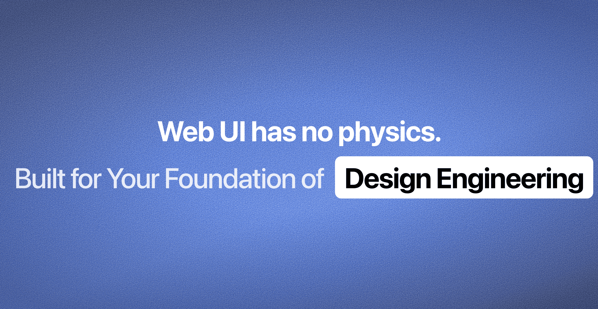

<div align="center">

<a href="https://ruixen.com">
  
</a>

<br />

# Ruixen UI

**Marketing UI for shadcn — in any stack.**

The component library for the *page that wraps your app*. 240+ React sections and components for landing pages — hero blocks, pricing tables, FAQs, footers, navbars, and the primitives around them. Generated from a single source codebase into four registry variants (Tailwind v3/v4 · Radix/Base UI) and installed with one CLI command.

[](LICENSE)
[](https://ruixen.com/docs)
[](https://pro.ruixen.com)
[](https://twitter.com/ruixen_ui)

[Sections](https://ruixen.com/docs) &nbsp;&middot;&nbsp; [Components](https://ruixen.com/docs) &nbsp;&middot;&nbsp; [Pro Templates](https://pro.ruixen.com) &nbsp;&middot;&nbsp; [Gradients](https://ruixen.com/gradients) &nbsp;&middot;&nbsp; [Blog](https://ruixen.com/blog)

</div>

<br />

## What Ruixen is for

shadcn solved primitives. Ruixen solves **the surface that ships when you publish** — the hero that gets the click, the pricing table that converts, the FAQ that closes the deal, the footer customers actually read.

If you've ever opened a fresh Next.js project, scaffolded shadcn, and then realized you still need to design every marketing block from scratch — that's the gap. Ruixen fills it. Sections, components, gradients, and templates that look like they shipped in 2026, not 1995.

<br />

## In any stack — really

Every component in the catalog is generated into **four registry variants** from one source codebase at build time:

| | Tailwind v4 | Tailwind v3 |
|:---|:---|:---|
| **Radix UI** | `r/<name>` | `r/tw3/<name>` |
| **Base UI** | `r/baseui/<name>` | `r/baseui/tw3/<name>` |

Pick the URL that matches your stack from the docs sidebar. The CLI does the rest — no peer-dep gymnastics, no provider to wrap, no global CSS to import. Pinned to Tailwind v3 for legacy compatibility? Evaluating Base UI for accessibility or licensing? Running the latest? Ruixen ships for all of you.

<br />

## Quick start

```bash
# Tailwind v4 + Radix  (default)
npx shadcn@latest add "https://ruixen.com/r/staggered-faq-section"

# Tailwind v3 + Radix
npx shadcn@latest add "https://ruixen.com/r/tw3/staggered-faq-section"

# Tailwind v4 + Base UI
npx shadcn@latest add "https://ruixen.com/r/baseui/staggered-faq-section"

# Tailwind v3 + Base UI
npx shadcn@latest add "https://ruixen.com/r/baseui/tw3/staggered-faq-section"
```

The component lands in your project with dependencies resolved. Just JSX — yours to edit, ship, and refactor.

<br />

## Built with intention

The catalog isn't styled to look good in a screenshot — it's built to feel right in production. Where it matters, components carry weight:

- **Motion as physics, not transitions.** Buttons, switches, badges, and accordions use spring configs from `motion/react` — momentum, overshoot, settling. Not a 300ms ease-out timer pretending to be life.
- **Audio as feedback.** Interactive primitives ship with a 3ms Web Audio click on press for a tactile feel. Opt out per-component with `sound={false}`.
- **Tokens, not hex.** Every component reads from shadcn theme tokens (`bg-card`, `border-border`, `text-foreground`). Change one CSS variable, re-skin the catalog.
- **Identical code, different wrappers.** Switching from Radix to Base UI doesn't change the component file — just the underlying primitive layer. Component logic stays portable.

Most of the catalog is pure render. Physics and audio are a flavor on the interactive primitives, not a tax on everything else.

<br />

## Showcase

<table>
<tr>
<td width="33%" align="center">
<video src="https://github.com/ruixenui/ruixen.com/raw/refs/heads/main/public/landing-page-previews/faq-chat-accordion-dark.mp4" width="100%" autoplay loop muted playsinline></video>
<strong>FAQ Chat Accordion</strong><br /><sub>Conversational FAQ section</sub>
</td>
<td width="33%" align="center">
<video src="https://github.com/ruixenui/ruixen.com/raw/refs/heads/main/public/landing-page-previews/wordmark-footer-dark.mp4" width="100%" autoplay loop muted playsinline></video>
<strong>Wordmark Footer</strong><br /><sub>Half-cut brand footer with luminance gradient</sub>
</td>
<td width="33%" align="center">
<video src="https://github.com/ruixenui/ruixen.com/raw/refs/heads/main/public/landing-page-previews/split-feature-showcase-dark.mp4" width="100%" autoplay loop muted playsinline></video>
<strong>Split Feature Showcase</strong><br /><sub>Side-by-side feature highlight section</sub>
</td>
</tr>
<tr>
<td width="33%" align="center">
<video src="https://github.com/ruixenui/ruixen.com/raw/refs/heads/main/public/landing-page-previews/integration-and-stats-section-dark.mp4" width="100%" autoplay loop muted playsinline></video>
<strong>Integration &amp; Stats Section</strong><br /><sub>Logos and metrics block for trust-building</sub>
</td>
<td width="33%" align="center">
<video src="https://github.com/ruixenui/ruixen.com/raw/refs/heads/main/public/landing-page-previews/rising-glow-dark.mp4" width="100%" autoplay loop muted playsinline></video>
<strong>Rising Glow</strong><br /><sub>Animated particles for hero accents</sub>
</td>
<td width="33%" align="center">
<video src="https://github.com/ruixenui/ruixen.com/raw/refs/heads/main/public/landing-page-previews/badge-morph-dark.mp4" width="100%" autoplay loop muted playsinline></video>
<strong>Badge Morph</strong><br /><sub>Spring-animated status badge</sub>
</td>
</tr>
</table>

<p align="center">
<a href="https://ruixen.com/docs"><strong>Browse all 240+ components &rarr;</strong></a>
</p>

<br />

## What's inside

**Sections** &mdash; 59 marketing blocks across 8 categories

| | | | |
|:---|:---|:---|:---|
| Navbars (16) | Hero Sections (9) | Pricing (10) | FAQs (6) |
| Featured (6) | Testimonials (4) | Clients (4) | Footers (4) |

**Components** &mdash; primitives and effects across 24 categories

Buttons &middot; Inputs &middot; Cards &middot; Forms &middot; Accordions &middot; Avatars &middot; Badges &middot; Banners &middot; Backgrounds &middot; Text Effects &middot; Loaders &middot; Carousels &middot; AI Chat Inputs &middot; Audio &amp; Media &middot; Image Tools &middot; Video Players &middot; Checkboxes &middot; Selects &middot; Sliders &middot; Tabs &middot; Charts &middot; Dialogs &middot; Docks &middot; Stepper

**App UI** &mdash; bonus catalog for product interfaces

Calendars &middot; Event Calendars &middot; Date Pickers &middot; Pagination &middot; File Management &middot; Notifications &middot; Drawer &middot; Menu &middot; Breadcrumbs

**Gradients** &mdash; 31 hand-tuned 4K gradients (3840 &times; 2160) across 6 collections: Shade Shifters, Crimson Aura, Fractional Walls, Hero Gradients, Hue Flows, Moon Backgrounds. Free for personal and commercial use.

<br />

## Pro

When the free catalog isn't enough — when you need everything to look like it shipped from a design team that's been working together for a year:

- **50+ premium components** with motion polish and theme depth beyond the OSS catalog
- **2 production-ready templates** &mdash; *Intellune* (SaaS) and *Nguyen* (portfolio)
- **Lifetime updates** &mdash; every new component we ship lands in your project for as long as the project exists
- **Commercial license** included
- **Priority Discord support**
- **14-day money-back guarantee**

**$59 once. No subscription.**

[ruixen.com/pricing](https://ruixen.com/pricing) &nbsp;&middot;&nbsp; [pro.ruixen.com](https://pro.ruixen.com)

<br />

## Ships in public

New sections and components every week. Spring configs, interaction breakdowns, and the build itself happens on Twitter — follow [@ruixen_ui](https://twitter.com/ruixen_ui) to see what lands next.

The roadmap lives in [ROADMAP.md](./ROADMAP.md).

<br />

## Tech Stack

| | |
|:---|:---|
| **Framework** | Next.js 15 &middot; React 19 &middot; TypeScript 5 |
| **Styling** | Tailwind CSS v3 &amp; v4 &middot; CSS Variables &middot; shadcn theme tokens |
| **Motion** | Motion (framer-motion successor) &middot; GSAP &middot; Web Audio API |
| **Primitives** | Radix UI &amp; Base UI &mdash; component code is identical; only the wrapper layer differs |
| **Registry** | shadcn CLI &middot; JSON-based component registry &middot; one source &rarr; four variants at build time |
| **Content** | Content Collections &middot; MDX docs |

<br />

## Contributing

You only need to change **5 files** to add a new component. It takes about 10 minutes.

```bash
git clone https://github.com/ruixenui/ruixen.com.git
cd ruixen.com
pnpm install
pnpm dev
```

Read the [Contributing Guide](./CONTRIBUTING.md) for the full walkthrough, or study the [example PR](https://github.com/ruixenui/ruixen.com/pull/12) to see exactly which files to touch.

<br />

## Contributors

<a href="https://github.com/ruixenui/ruixen.com/graphs/contributors">
  
</a>

<br />
<br />

## Community

<p>
<a href="https://twitter.com/ruixen_ui"></a>&nbsp;
<a href="https://github.com/ruixenui/ruixen.com"></a>
</p>

<br />

## License

MIT &mdash; see [LICENSE](LICENSE) for details. The free catalog is yours to use in any project, commercial or otherwise.

<br />

---

<div align="center">
<strong><a href="https://ruixen.com">ruixen.com</a></strong>
<br />
<sub>Marketing UI for shadcn &mdash; in any stack.</sub>
</div>
